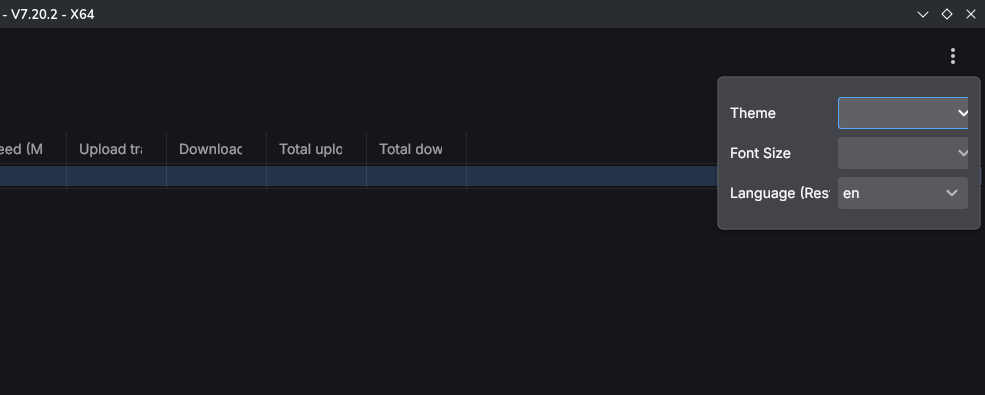
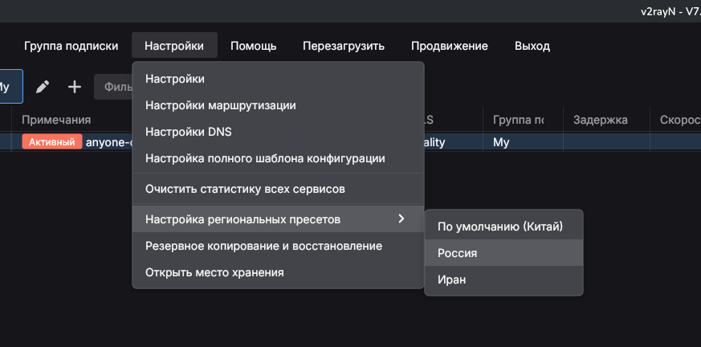
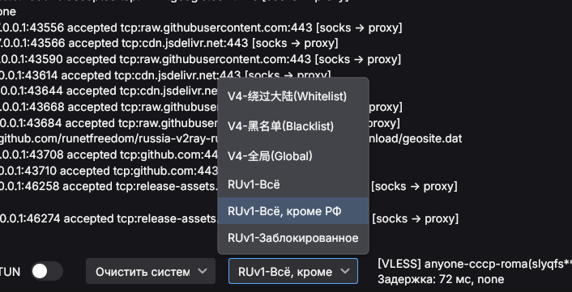
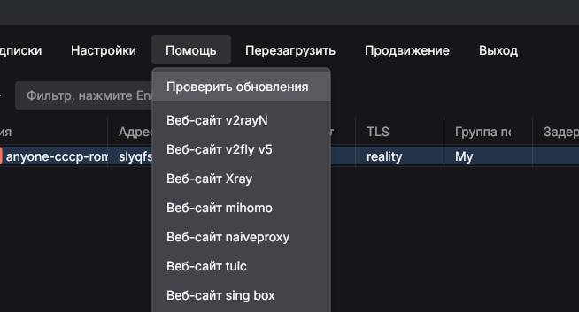

# 🚀 Настройка Geoip для PC
1. Для облегчения жизни ставим русский язык

2. Заходим в настройки, настройки региональных пресетов, Россия

3. В маршрутизации (снизу) выставляем `RUv1-Все, кроме РФ`

4. Для обновления (желательно делать каждый день) заходим в помощь и проверить обновления

