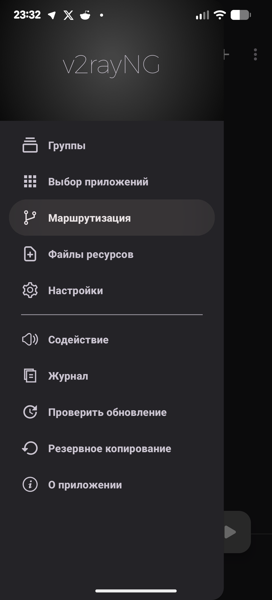
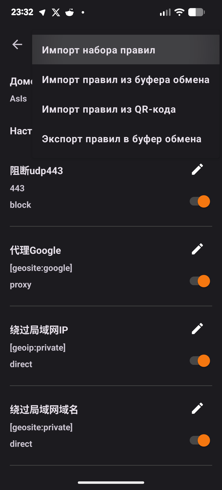
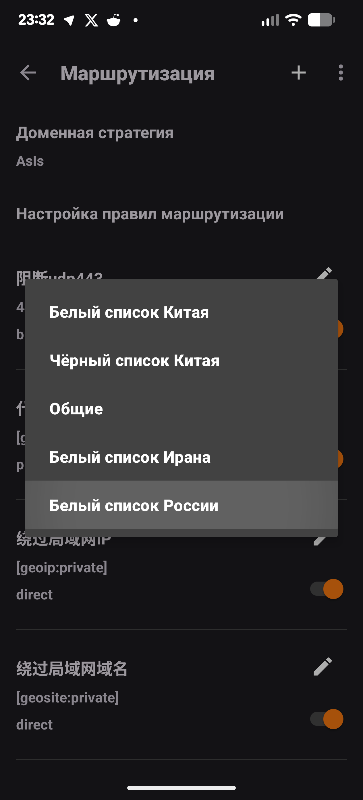
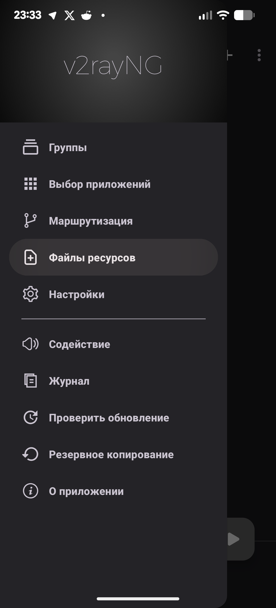
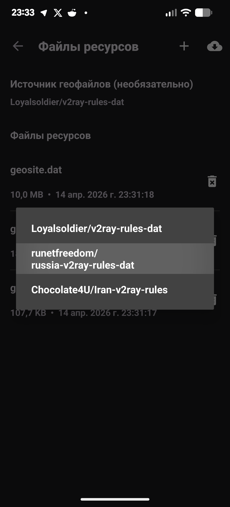

# 🚀 Настройка Geoip для Android
1. Переходим в настройки и маршрутизация 

2. Нажимаем на три точки и импорт набора правил

3. Выбираем Белый список России

4. Для дальнейшего обновления требуется перейти в главное меню, настройки, файлы ресурсов

5. Выбрать источник геофайлов, как показано на скрине

6. Нажать на облачко справа сверху